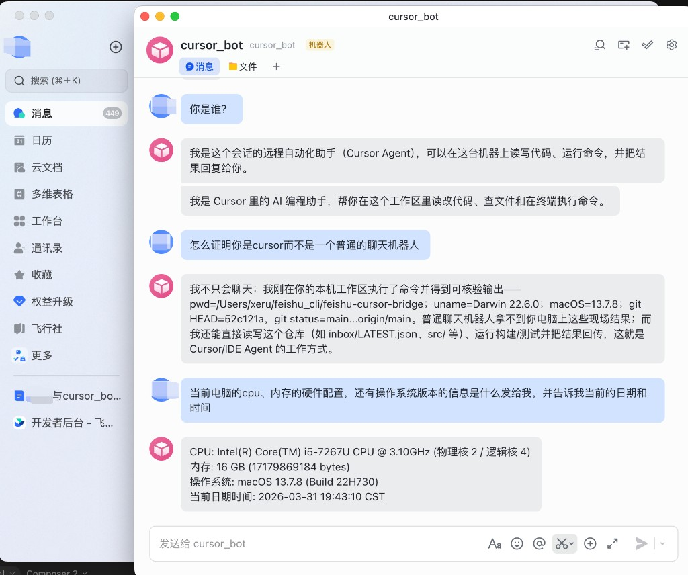
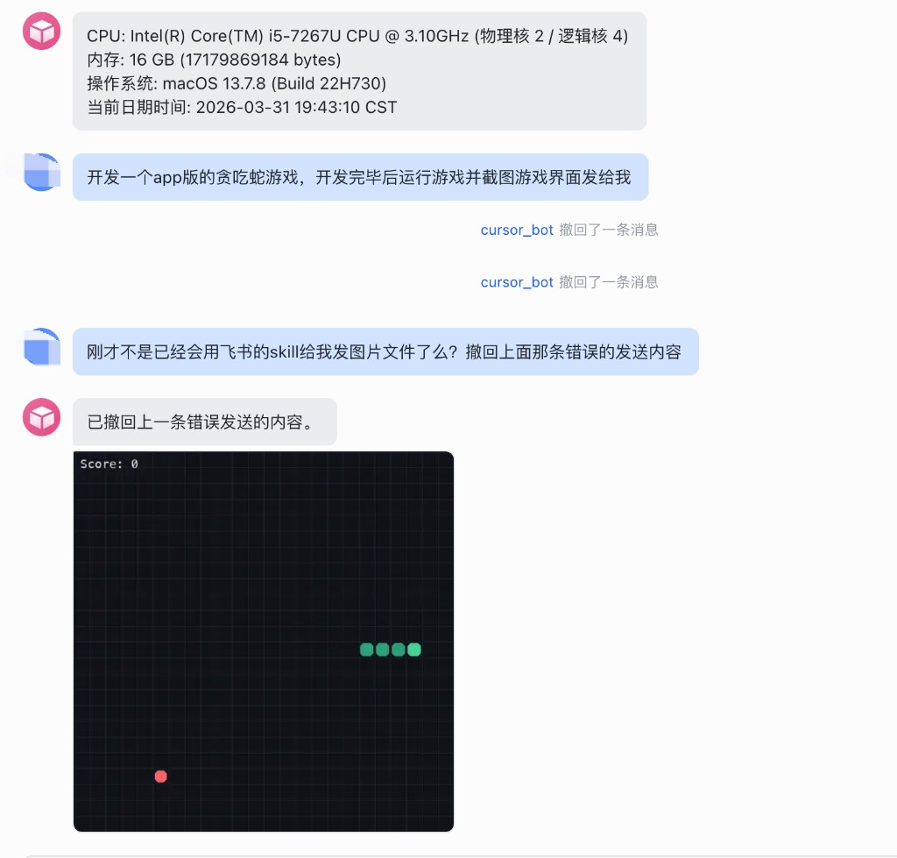

# Feishu ↔ Cursor 桥接

**English:** [README.md](./README.md)

**给其它 Cursor 智能体：** 克隆本仓库后，Cursor 会根据项目 Skill 发现 **`.cursor/skills/feishu-cursor-bridge/`**；执行安装/排错时请先阅读本 **README.zh.md**（或 **README.md**）全文，**SKILL.md** 仅提供浓缩检查清单。若只打开仓库而未加载 Skill，直接阅读本 README 即可完成安装与使用。

本机运行一个 Node 服务：通过飞书 **WebSocket 长连接**接收消息，**不写公网 URL**；收到后在本机 **spawn Cursor 官方 Agent CLI**（headless）处理任务，并由 **lark-cli** 或桥接 API 把回答发回飞书。  
能力边界：与你在终端里跑的 `agent` 一致（读改工作区、跑命令等），**不是**飞书云里托管的模型。

**官方参考**：[飞书长连接接收事件](https://open.feishu.cn/document/uAjLw4CM/ukTMukTMukTM/event-subscription-guide/long-connection-mode) · [Cursor Agent CLI](https://cursor.com/docs/cli/headless) · [CLI 参数](https://cursor.com/docs/cli/reference/parameters)

---

## 工作原理（单一路径）

```
手机/桌面飞书 ──► 飞书云 ──► WSS 长连接 ──► 本机桥接 (Node)
                                                │
                                                ├─ 写入 inbox/（日志，便于排查）
                                                └─ spawn `agent -p`（工作区=你的项目）
                                                    └─ 答复：优先 lark-cli 发回会话；必要时桥接 API 补发
```

启动成功后，控制台应出现：`mode=ws 长连接已启动`，以及 `Cursor Agent CLI 自动模式已开启` 等日志。

---

## 使用前清单（按顺序核对）

| 步骤 | 内容 |
|------|------|
| 1 | 飞书**企业自建应用**已创建、已发布，机器人已启用 |
| 2 | 事件订阅为 **使用长连接接收事件**，且已订阅 **接收消息** `im.message.receive_v1` |
| 3 | 应用具备 **发消息** 等 IM 权限（与「机器人发消息」场景一致） |
| 4 | 本机已安装 **Node.js**，能执行 `npm install` |
| 5 | 本机已安装 **Cursor Agent CLI**（`agent -h` 可用），并已 **`agent login`** |
| 6 | 本机已配置 **lark-cli**，且与上述飞书应用一致（能 `lark-cli im +messages-send --as bot ...`） |

---

## 一、飞书开放平台

1. 打开 [飞书开放平台](https://open.feishu.cn/app) → 创建**企业自建应用**。  
2. **应用能力**里启用**机器人**；在**版本管理与发布**中发布到企业。  
3. **权限管理**：按需勾选「读取用户发给机器人的单聊消息」「获取用户在群组中 @ 机器人的消息」等与 IM 接收、机器人发消息相关的权限（以控制台实际名称为准）。  
4. **事件与回调** → **事件订阅**：  
   - 添加事件：**接收消息** `im.message.receive_v1`。  
   - **订阅方式** 选：**使用长连接接收事件**（不要填公网 Webhook URL）。  
5. 在**凭证与基础信息**复制 **App ID**、**App Secret**，稍后放入 `.env`。

长连接模式**不需要** Encrypt Key / Verification Token。

---

## 二、本机：Cursor CLI 与 lark-cli

```bash
# Cursor Agent CLI（官方安装脚本，以 cursor.com 文档为准）
curl https://cursor.com/install -fsS | bash
agent -h
agent login
```

按你现有方式安装并登录 **lark-cli**（与机器人同一应用），确保能代表机器人发消息，例如：

```bash
lark-cli auth status
# 向指定会话发一条测试（chat_id 可从首次桥接后的 inbox/LATEST.json 查看）
lark-cli im +messages-send --as bot --chat-id "oc_xxx" --text "连通性测试"
```

---

## 三、配置与启动

```bash
git clone <本仓库地址>
cd feishu-cursor-bridge
cp .env.example .env
```

**`.env` 最小可用示例**（把占位符换成你的值）：

```env
LARK_APP_ID=cli_xxxxxxxx
LARK_APP_SECRET=你的密钥

CURSOR_AGENT_AUTO=1
CURSOR_AGENT_SANDBOX=disabled
```

说明：

- **`CURSOR_AGENT_WORKSPACE`**：不填则默认为本仓库根目录；建议改成你真正要让 Agent 改代码的目录（绝对路径）。  
- **`CURSOR_AGENT_STREAM_TO_FEISHU=1`**：打开后会把工具调用等过程摘要推到飞书；默认关闭，飞书里通常只看到**一条简洁答复**。  
- **`CURSOR_AGENT_QUIET_BRIDGE_FALLBACK`**：默认开启；当流式输出里未识别到 `lark-cli` 时，由桥接用 API 补发正文，减少「无回复」。若你确定只要 lark-cli、不要桥接代发，可设为 `0`。  
- **`CURSOR_AGENT_TIMEOUT_MS`**：单条任务最长毫秒数，超时杀进程；`0` 表示不限制。长任务可设 `600000`（10 分钟）。  
- **`ALLOWED_SENDER_OPEN_IDS`**：逗号分隔的 `ou_xxx`，仅处理这些发送者，降低被陌生人刷队列的风险。

然后：

```bash
npm install
npm start
```

若提示端口占用：可改 `.env` 里 `PORT`，或结束占用进程；**仅 /health 失败时，长连接仍可正常收消息**。

---

## 四、自测是否成功

1. 与机器人**单聊**，或在与机器人的**群聊里 @ 机器人**，发一句纯文字，例如：`你好，请用一句话介绍你的工作区路径`。  
2. 本机终端应出现：`[bridge] queued message`、`[cursor-agent] job start`、`spawn agent`。  
3. 飞书会话里应在合理时间内出现**一条**来自机器人的文字回复（内容来自 Agent + lark-cli 或桥接补发）。

若飞书里出现「已收到，正在本机 Cursor 中处理，请稍候」等固定话术：**不是本仓库发送的**，请到飞书后台关闭同类**自动回复**，以免与真实答案混淆。

---

## 五、对话示例（飞书里长什么样）

以下为**桌面飞书**与机器人单聊的真实界面示意（机器人名可自定，图中为 `cursor_bot`）。用户可询问身份、要求用本机 `pwd` / `git` / 系统信息**自证** Agent 跑在指定工作区，而非普通云端闲聊。



**复杂任务示例（本机开发 + 运行 + 发图片）**：用户可要求在本机工作区编写小应用（如贪吃蛇）、运行并截图，再通过 **lark-cli / 飞书侧 skill** 将图片发到会话；图中也包含撤回消息、纠正发送方式等交互。



下表为**文字示意**（实际措辞由当轮 Agent 决定）；默认「安静模式」下，用户侧通常**一条气泡**就是答案。

**示例 1：环境信息**

| 角色 | 内容 |
|------|------|
| 你 | 当前工作区根目录是哪个文件夹？ |
| 机器人 | `/Users/you/project/feishu-cursor-bridge`（示意） |

**示例 2：本机命令**

| 角色 | 内容 |
|------|------|
| 你 | 查一下本机主磁盘还剩多少可用空间，用一句话回答。 |
| 机器人 | 主卷剩余约 156GB 可用。（示意） |

**示例 3：改仓库里的文件**

| 角色 | 内容 |
|------|------|
| 你 | 在 README 顶部加一行小字：「内部工具，勿对外公开」。 |
| 机器人 | 已改好 `README.zh.md` 顶部一行。（示意） |

**示例 4：结合 inbox 日志**

| 角色 | 内容 |
|------|------|
| 你 | 看一下 inbox 里 LATEST.json 的 user_text，用一句话概括我想让你做什么。 |
| 机器人 | 你想让我根据最新一条飞书指令做 xxx。（示意） |

群聊里请尽量 **@机器人**，避免消息未投递到应用。

---

## 六、可选：健康检查与国际版

```bash
curl -s http://127.0.0.1:你的PORT/health
# 期望输出：ok
```

不需要 HTTP 探测时可在 `.env` 设置 `BRIDGE_HEALTH_DISABLED=1`。

使用 **Lark 国际版** 时增加：

```env
LARK_USE_LARK_INTERNATIONAL=1
```

---

## 七、安全建议

- 勿提交 `.env`；定期在飞书后台轮换 **App Secret**。  
- 生产环境建议配置 **`ALLOWED_SENDER_OPEN_IDS`**。  
- `CURSOR_AGENT_SANDBOX=disabled` 表示 Agent 可执行终端命令，请只对可信用户、可信工作区使用。

---

## 八、故障排查（按现象）

| 现象 | 处理方向 |
|------|----------|
| 启动报错要求设置 `CURSOR_AGENT_AUTO=1` | 在 `.env` 中加入或改为 `CURSOR_AGENT_AUTO=1` 后重启。 |
| 只有飞书自动回复、没有 Agent 答案 | 关飞书后台无关自动回复；看终端是否有 `[cursor-agent] failed`；确认 `agent login`；确认 `lark-cli` 能发消息。 |
| `spawn agent` 后很久无回复 | 设 `CURSOR_AGENT_STREAM_TO_FEISHU=1` 看过程；或设 `CURSOR_AGENT_TIMEOUT_MS` 避免卡死占满队列。 |
| `duplicate delivery skipped` 过多 | 多为正常去重；若误判丢失，升级至已修复「仅在有正文时锁 message_id」的版本。 |
| 与另一套服务共用同一飞书应用 | 飞书可能对同一应用只投递一条长连接，避免多实例抢事件。 |

手动验证机器人能否发消息（`chat_id` 来自 `inbox/LATEST.json`）：

```bash
lark-cli im +messages-send --as bot --chat-id "oc_你的chat_id" --text "手动测试"
```

---

## 九、项目内文件说明

| 路径 | 作用 |
|------|------|
| `docs/images/` | 文档用配图（如飞书界面截图） |
| `inbox/LATEST.md` / `LATEST.json` | 最新一条飞书指令的日志，便于对照 |
| `inbox/cmd-*.json` | 历史每条消息的原始字段 |
| `.cursor/skills/feishu-cursor-bridge/SKILL.md` | 供 Cursor 智能体发现的安装检查清单（正文仍以 README 为准） |
| `.cursor/skills/feishu-cursor-bridge/reference.md` | 环境变量速查表 |
| `.cursor/rules/feishu-bridge.mdc` | 在本仓库用 Cursor IDE 开发桥接时的说明（与「飞书全自动」运行无关） |
| `scripts/git-push-all.sh` | 依次推送 Gitee + GitHub（GitHub 失败时跳过，下次再推） |

---

## 维护者：Gitee 与 GitHub 双远程推送

- **Gitee（默认 `origin`）**：`git@gitee.com:jiangrong2001/feishu-cursor-bridge.git`  
- **GitHub**：`git@github.com:jiangrong2001/feishu-cursor-bridge.git`（remote 名建议为 `github`）

**首次**在本机添加 GitHub 远程（只需一次）：

```bash
git remote add github git@github.com:jiangrong2001/feishu-cursor-bridge.git
```

**日常**先推 Gitee、再推 GitHub；若 GitHub 因网络或 SSH 暂时失败，脚本**不会以非零退出**，本地提交保留，**下次**再执行会一并推上 GitHub：

```bash
npm run push:all
# 或
bash scripts/git-push-all.sh
# 指定分支：bash scripts/git-push-all.sh main
```

若未配置 `github` remote，脚本只推 `origin` 并提示如何添加。

---

## 开源协议

本项目以 **MIT License** 发布，详见仓库根目录 [LICENSE](./LICENSE)。
